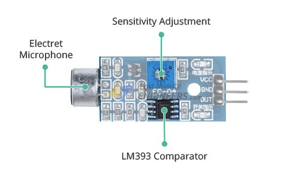
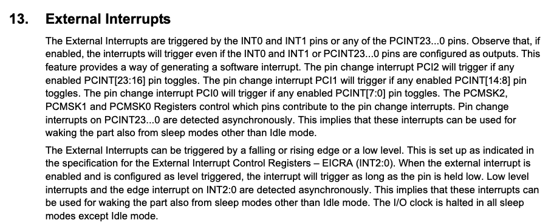
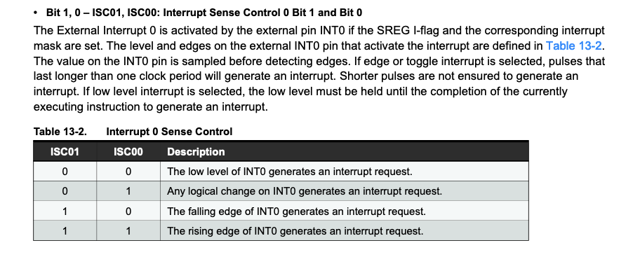
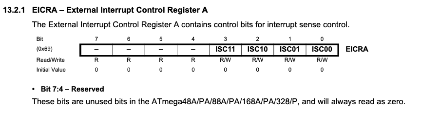
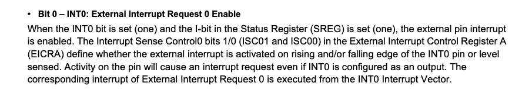

# Chapter 3 - Making Ears

Now that we have the very basics down. It is time to begin implementing the actual clap light. We will start with our sound module. Our supplies doc has a link to a brief tutorial on how it works if you would like to know more.

Long story short, the sound sensor is a detector, not just a microphone. When powered on it is constantly listening and comparing the volume of whatever noise it is hearing with a threshold that we set by physically rotating the potentiometer.



The sensor will output LOW when the detected sound is above the threshold, and HIGH otherwise. This makes interfacing with it easy since we can just hook it up to a GPIO pin, and do something when we detect a LOW signal (for now we will turn on the onboard LED).

So the general flow of our program will look something like:
1. Set up the pin for the onboard LED as output
2. Set up the pin for the sound sensor as input (we will use D2)
3. Receive LOW signal at D2 when the sensor detects a sound
4. Turn on the onboard LED
5. Turn off the onboard LED after some time

## Setting up a pin for input
Similar to setting up a pin for output, we set a pin for input by setting the DDxn pin to logic zero. In our case we are using D2, so we need to set DDD2 to logic zero. From before we should get:

```
DDRD &= ~(1 << DDD2);
```

## Getting input from the sensor
Now that we have the pin configured for input, it is time to actually get data from the sensor. Typically if you were to do this in Arduino, you would have a call to digitalRead() in the super loop and do what you want with that value.

Now we could do that. We could just take a look at what value in at PIND2 with each iteration of our super loop. But this is quite inefficient. Instead, we are going to do nothing until we are told that something happens. In our case that something when PIND2 is driven LOW by our sound sensor and the mechanism we will use to acheive this is by interrupts, particularly external interrupts, as we are reacting to voltage changed coming from an external device.



Accoriding to the 328p datasheet, external interrupts can be triggered by falling edge, rising edge, or a low level. Since our sound sensor will output HIGH in its "resting" state and LOW when it detects a sound over the threshold, we will configure our interrupt to trigger on the falling edge, or when the PIN goes from HIGH to LOW.

We will use the INT0 external interrupt pin, and we will use the External Interrupt Control Registers (EICRA) configure the interrupt to trigger on the falling edge.



From the datasheet we need to set ISC01 to logic one and ISC00 to logic zero. Taking a look at the layout of the EICRA



We get:
```
EICRA |= (1 << ISC01);
EICRA &= ~(1 << ISC00);
``` 

Reading onwards we see that we need to set two more bits to enable to INT0 external interrupt.



We will include setting of the INT0 bit to logic one in EIMSK in the setup code:
```
EIMSK |= (1 << INT0);
```

For the second portion, we will use the sei() function from the interrupt.h file to set the Global Interrupt Enable bit which enables interrupts for our application.

## Doing something with an interrupt
Now we have our interrupt configured to trigger on the falling edge. So when our sound detector detects a sound over the threshold, it will write LOW to it's output which is connected to our D2 pin. When this pin goes from HIGH to LOW (i.e. falling edge), it will trigger our interrupt.

Okay the interrupt is triggered. Time to do something, i.e. turn on our onboard LED. We will first define a function for turning on the onboard LED, same as before.

To call this function when the INT0 external interrupt is triggered, we use something called an interrupt service routine (ISR) from our avr-libc. It is a macro so we use it by the following:

```
ISR (INT0_vect)
{
	led_on();
}
```

Note that the ISR macro is from the avr/interrupt.h file, same as the sei() function.

## Putting it all together
We have now laid out how we will set up the GPIO pin for input, set up the interrupt, and control the LED from the interrupt. We will pack everything into their own functions, and call them in the following order:
1. Set up the output pin for the onboard LED
2. Defining how we will interact the LED (turn on/toggle)
3. Set up the input pin. Enable the INT0 external interrupt and configure to trigger on a falling edge.
4. Enable the global interrupt bit
5. Define the interrupt service routine to define our interrupt handler on INT0

You should have something like the following:

```
#include <avr/io.h>
#include <avr/interrupt.h>
#include <avr/sleep.h>

void init_led()
{
	DDRB |= (1 << DDB5);
}

void led_off()
{
	PORTB &= ~(1 << PORTB5);
}

void led_on()
{
	PORTB |= (1 << PORTB5);
}

void led_toggle()
{
	PINB |= (1 << PINB5);
}

void init_input()
{
	DDRD &= ~(1 << DDD2);
	EICRA |= (1 << ISC01);
	EICRA &= ~(1 << ISC00);
	EIMSK |= (1 << INT0);	
}

ISR (INT0_vect)
{
	led_toggle();
}

int main(void)
{
	init_led();
	led_off();
	init_input();
	sei();

	set_sleep_mode(SLEEP_MODE_STANDBY);
	for (;;)
	{
		sleep_mode();
	}
}
```

Note there are a couple of extra functions for controlling the LED. We also setup sleep mode to reduce power consumption. More on this later but for now know this is one of the benefits if using interrupts.

Once uploaded, play around with it. You'll quickly notice that it isn't perfect. Particularly if we are using the led_toggle() function to control the LED and the noise provided is sustained. We will look to address these issues next.
