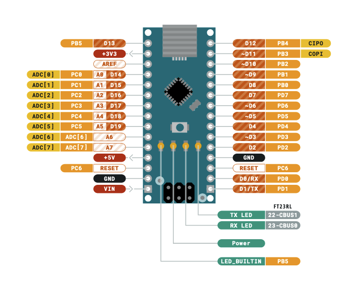
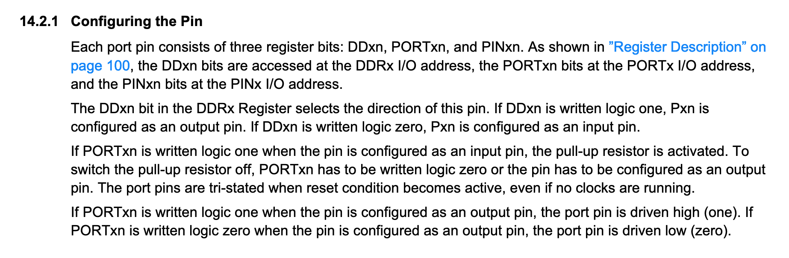
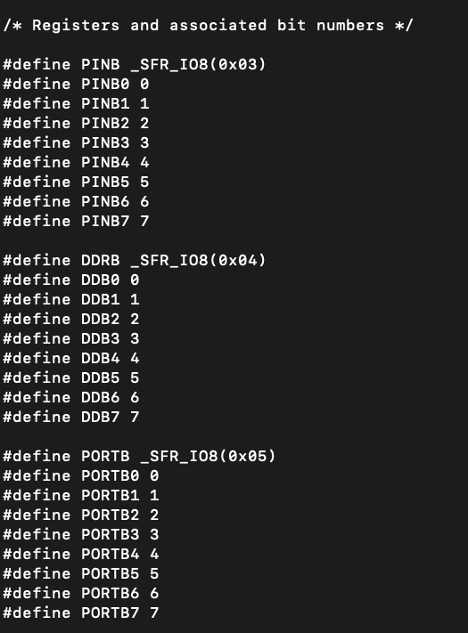
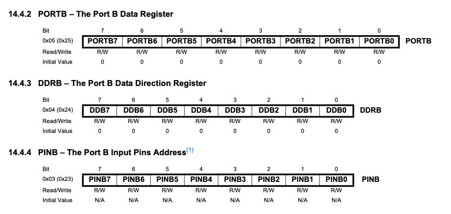

# Chapter 1: Arduino without Arduino

As per the reqs, we want to avoid using the Arduino libraries if we can. But, we still opted for an Arduino board because of the many resources that are out there. This is a common starting point for delving into embedded systems deeper than what using Arduino libraries allows.

## Toolchain
The MCU that is on our Arduino Nano board is the ATmega328P from AVR (formerly Atmel). AVR has graciously provided us with a group of tools, called a toolchain to aid in writing software for their MCUs
[AVR-LibC Documentation](https://avrdudes.github.io/avr-libc/avr-libc-user-manual/index.html)

### Components
The main components we will be using from this toolchain are listed below.

#### avr-gcc
The version of the GCC cross compiler that targets AVR.

#### avr-objcopy
A tool from GNU Binutils (Binary Utilities) for copying and translating object files to different formats, built to target AVR.

#### avr-dude
AVR Downloader Uploader is a command line tool for downloading and uploading the on-chip memories of AVR microcontrollers. It is what we will use to flash our program onto our board.

### Installing and Building the Toolchain

The host system I am using is a MacBook Pro with an M2 chip. The easiest way to install the AVR toolchain is using Homebrew.

`brew tap osx-cross/avr`

This first command taps the osx-cross/avr repository adding it to the list of repos Homebrew tracks, pulls from, etc.

`brew install \
    avr-gcc \
    avrdude \
    minicom \
    cpputest \
    pkg-config \
    gcc`

Next we actually install the tools. You see a few of the tools we listed above here. avr-objcopy is installed as a part of avr-binutils which comes as a part of avr-gcc

Check the installation path for more info. For my machine it is 
/opt/homebrew/Cellar/avr-binutils/2.43.1/avr/bin/objcopy

/opt/homebrew/Cellar/avr-gcc@9/9.4.0_1/avr/include/avr

## Hello World

Based off tutorial found [here](https://github.com/rubberduck203/embedded-101)

Starting off with the basic hello world of microcontrollers, blinking the on board LED.

### Code
```
// hello-world.c  
#include <avr/io.h>  
#include <util/delay.h>  

int main(void)  
{
	DDRB |= (1 << DDB5);

	for(;;)
	{
		PORTB |= (1 << PORTB5);
		_delay_ms(500);
		PORTB &= ~(1 << PORTB5);
		_delay_ms(500);
	}
}
```
This task is simple enough where we only need a single source file

### Analysis
We first include two header files. delay.h brings in the _delay_ms function, for well, delaying the specified number of milliseconds. io.h brings in the macros that we see in the code namely DDRB, DDB5, PORTB, and PORTB5. When we compile our code next, we will specify some options that will tell the compiler to use a specific io header file for our MCU.

But how do we know what macros to use? Well we will start by working backwards.

Our goal is to blink the onboard LED of our Nano. To do this, we need to find out what pin maps to that LED. So we look at the pinout for our Arduino Nano.



At the very bottom we have LED_BUILTIN pointing to our onboard LED and see that it maps to PB5, short for Port B, bit 5. So to manipulate the onboard LED we need to do something with the fifth bit on Port B. But what exactly is Port B? And what do we need to do? For that we now take a look at [the datasheet for our ATMega328p](http://ww1.microchip.com/downloads/en/DeviceDoc/ATmega48A-PA-88A-PA-168A-PA-328-P-DS-DS40002061A.pdf)

Searching through datasheets takes time to get used to, and it a skill I am still developing. Doing a search for "configuring" find us on the section below.



Now we are finally getting more of an explanation. We see that PORTB5, or more generally PORTxn, is one of three register bits for each port pin. We also have DDxn and PINxn. Substituting in the values for x and n for the port we are using (B) and the bit of the register we care about (5), we have DDB5, PORTB5, and PINB5.

Taking a look at the second paragraph in the screenshot, we see we need to configure the pin as either an input or an output. If you have used Arduino before, you are probably familiar with this procedure. Luckily without Arduino, it's still just one line of C code. Since we want to blink the LED, the pin will be configured as an output pin, and we do this by writing the DDB5 bit of the DDRB register to logic one.

Now we can finally blink the LED. Taking a look at the final paragraph of the above screenshot, we can see that when the pin is configured as an output pin, we can write a logic one to the PORTB5 register bit to drive the port pin PB5 high. This will turn the LED on. Writing logic zero to PORTB5 will drive the port pin PB5 low and turn off the LED.

### Sanity Check
Before we delve into how to actually write to register bits, let's do one last check that everything looks right. Taking a look inside /opt/homebrew/Cellar/avr-gcc@9/9.4.0_1/avr/include/avr we see the io file for our MCU, iom328p.h that we mentioned earlier will be used in place of io.h when we compile our code. Searching this file for our registers shows us the following:



We'll compare this with the register descriptions found in our MCU datasheet, which they so kindly tell us in the section about configuring pins that it is located on page 100:



We see the DDRB register is the port B data direction register located at memory address 0x04. We also see DDB5 is the fifth bit of this register. So if we represent the DDRB as the byte 0x00100000, the single 1 represents DDB5. This information is confirmed in our iom328p.h file. Similar logic can be applied for the other two registers, though we will only be using DDRB and PORTB registers for now.

---

### Bitwise Operations and Writing to Registers
Now to begin really building the code, we will start with configuring PB5 as an output pin. As we said before, we need to set DDB5 to logic one which looks like 0x00100000, but really all we care about is that that DDB5 bit is 1, the rest should remain as they are.

Achieving this can be performing an operation called bit shifting, denoted in C as either << or >>. We will focus on the first operator, << which is the left shift operator.

```
1 << 5
```
A bitwise left shift will shift the bits of the first operand by the number of positions specified by the second operand, discarding the bits on the left that got pushed out and filling in the empty space on the right with zeros. In our example above, we will shift the bits of the number 1 by 5 positions. 1 represented as an 8-bit binary number is 0x00000001. Doing our left shift by 5 positions gives 0x00100000. Exactly what we want!

Now we knew how much we needed to shift by, but there's no need to guess as our iom328p.h file defined this for us. We see DDB5 is defined as 5, so we can instead to 1 << DDB5.

Now to get this value to DDRB and actually write the bit to one we can do a bitwise OR operation between the current value of the register and our shifted number. An OR operation, represented by ||, has the following truth table:

```
0 || 0 = 0
0 || 1 = 1
1 || 1 = 1
1 || 1 = 1
```

So if we can guarentee that the DDB5 bit will be a one, and leave all other bits to whatever they are currently set at, if we do a bitwise OR between the current value of the register, DDRB, and 0x00100000, which we got from 1 << DDB5, and then writing the result back to DDRB.

```
DDRB = DDRB || (1 << DDB5)
```

Shortening this line gives us the line we see in our code:

```
DDRB |= (1 << DDB5)
```

We also mentioned above that to turn the LED on, we need to do the same thing but to the PORTB register. So it follows that to write logic one to the PORTB5 bit of the PORTB register, we can write:

```
PORTB |= (1 << PORTB5)
```

For turning the LED off, we need to do something similar, only writing the PORTB5 bit to logic zero. Similar to how when we turned the LED on, we didn't just set PORTB = 0x00100000 becasuse we wanted to keep all the other bits the same, we can't just set PORTB = 0x00000000 or something similar. To do this, while guarenteeing that the PORTB5 bit is 0, we will first do our normal bit shift, but follow it up with an inversion operator ~:

```
~(1 << PORTB5)
```

Resulting in 0x11011111. Now ORing this with PORTB would set all the bits to 1 but keep PORTB5 at whatever it currently is. We need the opposite. We can instead use a bitwise AND (&&). Truth table is as follows:

```
0 && 0 = 0
0 && 1 = 0
1 && 0 = 0
1 && 1 = 1
```

By ANDing with 0x11011111, since the bit in the position of PORTB5 is 0, the bit corresponding to PORTB5 is guarenteed to be 0. Also, since all other bits are 1, ANDing in all other positions will make the final result just be whatever was already in those positions in PORTB.

Putting it all together, we get a similar result to turning the LED on, only with this new logic, which is what we see for our last mystery line of code:

```
PORTB &= ~(1 << DDB5)
```
